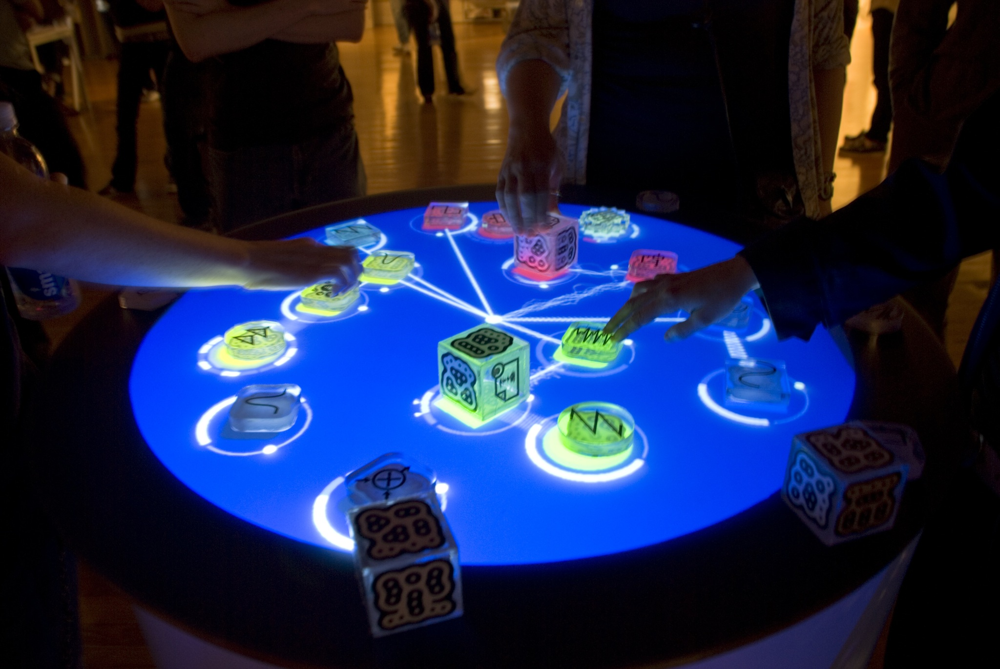
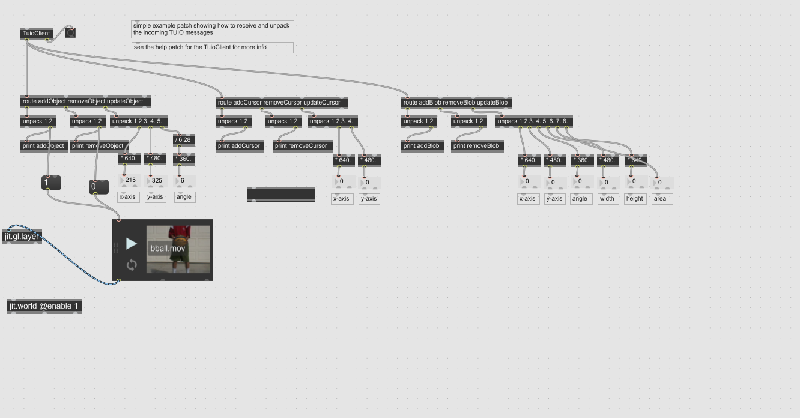
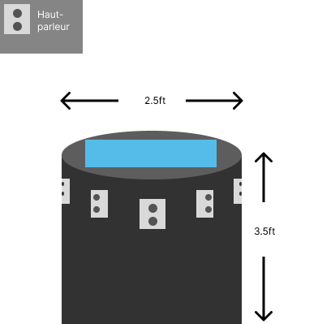
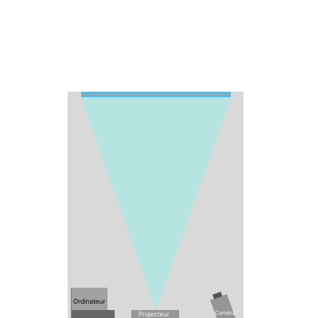
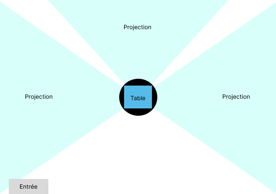
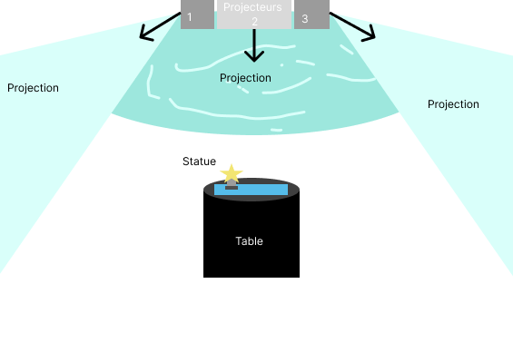
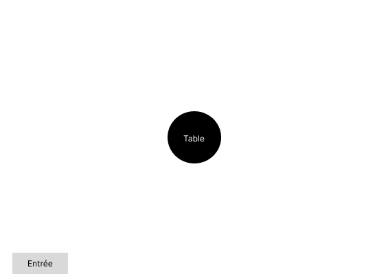

# Les cool affaires que j'ai trouvé

## Contrôle d'environement par des images.
La reactable est un instrument de musique très particulier, il consiste d'une table dont le plateau est un écran tactile dans lequel une caméra est présente ainsi que d'objets, les objets à mettre sur la table sont des modules avec lesquels nous sommes familier tel qu'un VCO ou un VCF. La partie dont je m'intéresse est celle où la table réagit aux objets présents sur elles en se basant sur des images présents sur eux.

###### Image d'une reactable.

###### By Daniel Williams from NYC, USA - The Reactable, CC BY-SA 2.0, https://commons.wikimedia.org/w/index.php?curid=2429598

### Technologie

Détection et suivi sur des références présentes sur des objets.

### Intéractivité

Lorsque la caméra détecte une des formes, il la reconnaît comme un module de synthétiseur.

### Qu'est-ce qu'on peut faire avec ce concept

Lorsque j'ai appris l'existence de ce projet, j'ai immédiatement pensé à la technologie que nous apprenons en ce moment à utiliser en cours de VR pour créer de L'AR.
D'après Lora il serait possible de faire un jeu avec unity qui se contrôle en posant quelque-chose tel que des feuilles de papier avec des images dessus. On peut très probablement faire des choses avec d'autres logiciels également avec cette idée. Si l'instalation est construite de manière à ce que l'image sois toujours dans le même sens, il serai très probablement possible de faire quelque-chose à partir de max avec cette idée, comme par exemple avoir de la lumière qui change dépendement de l'image que max reçoit présentement. L'idée d'avoir une caméra qui cherche une information spécifique et changer quelque chose dans le réel par rapport au résultat est une idée qui a du très grand potentiel.

###### Reactable en action.

###### Reactable legacy sur youtube, https://www.youtube.com/@reactable

## Programme derrière la reactable

Pour fonctionner, la reactable utilise un logiciel libre de droit s'appelant reacTIVision, ce programme identifie des fiducials ainsi que les doigts, ce que est pourquoi la reactable détecte les commandes de l'intéracteur sur la table et fait un lien avec ce que le projecteur affiche.

### Compatibilité

reacTIVision est entièrement compatible avec max, ce qui veux dire que la détection de fiducials pourrait être présente dans quelquonque projet utilisant des caméras ainsi que max, je n'ai pas testé les limites du logiciel, mais il devrait être capable de détecter les fiducials si ils sont présent devant la caméra, il faudrait simplement calibrer le logiciel afin qu'il puisse calculer correctement ses distances, comme il est originalement fait pour être utilisé avec une caméra sous une table, il risque par contre d'avoir des problèmes si on lui dit de scanner une salle, car il va tenter de trouver les fiducials à une certaine distance uniquemenet. En rajoutant quelques éléments au patcher d'exemple qui est fourni avec le logiciel, j'ai pu faire fonctionner une vidéo à la détection d'un fiducial, ce qui veux dire que l'utilisation de max pour la détection de fiducials est possible et cela mène à plusieurs options.

Pour installer le logiciel, simplement aller sur [ce site](https://reactivision.sourceforge.net)

###### Image du patcher

### Conclusion

La détection de fiducials pourraient être un chemin intéressant à prendre pour emmener de l'intéractivité au projet, je pense qu'il y a beaucoup de potentiel dans cette idée.

## Conception de la reactable et idée de projet

Pour le plateau de la reactable, on prévois utiliser deux couches d'acrylique avec du papier calque entre les deux, cela permetterai à la lumière de passer, tout affichant ce qui est voulu sur la table. Pour la table elle-même, elle pourrait être sois en métal ou en bois.

## Idée de projet

Pour notre projet, nous allons avoir besoin d'un espace renfermé, que ce soit le petit studio ou un bout du grand studio, originalement nous prévoyons faire quelque chose impliquant un jeu, mais je pense qu'avec où la classe s'en va avec le thème, je pense que faire quelque chose de plus contemplatif serai à notre avantage. Ce que je veux faire, c'est avoir une salle avec la reactable au centre, et avoir une projection sur les murs, cette projection changerai dépendement de ce qui est présent sur la table. Des hauts-parleurs seraient présents dans la table pour de la spatialisation 3D. Les effets sur les murs pourraients être similair à ce qu'on peut trouver dans le jeu [Tetris Effect](https://youtu.be/urbLIyd-VsQ).
 
Il y aurait 3 projecteurs présents, chacun affichant quelqu-chose sur un mur.

###### Vue de haut

###### Vue de face
 
Lorsque personne n'est dans la salle, tout les projecteurs seronts éteints

###### Absence d'intéracteurs
La reactable sera le lien entre l'intéracteur et le projet, elle n'est pas utilisée exactement comme elle est pensée, mais comme on peut communiquer directement avec max, on peut faire tout ce qu'on veux avec. 
